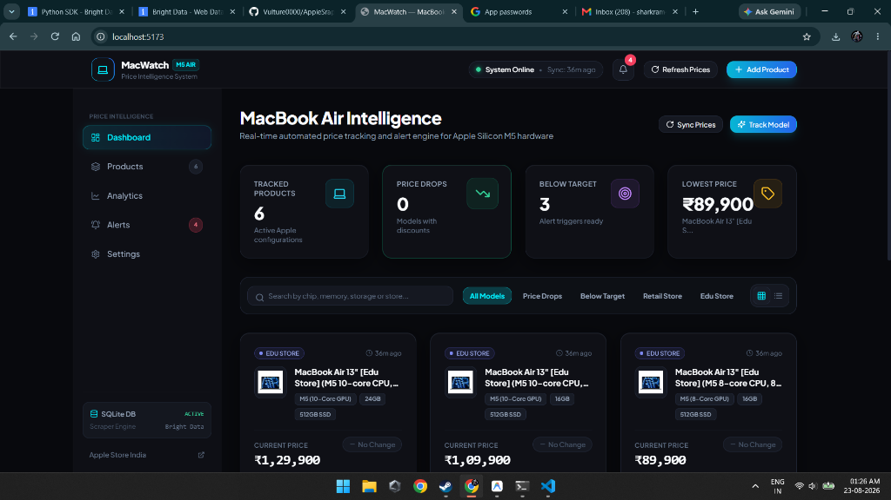
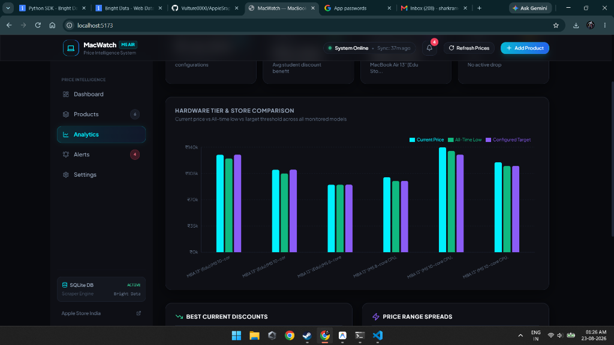
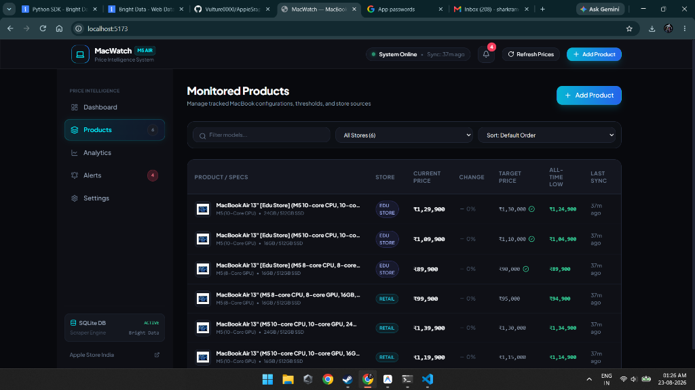
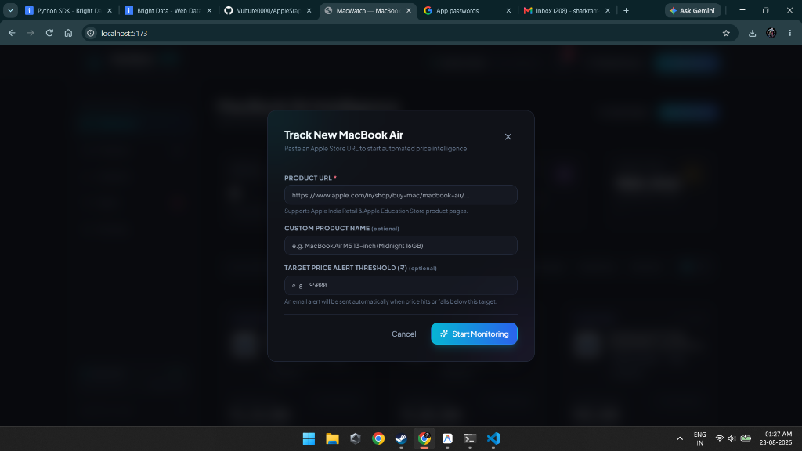

# MacWatch — MacBook Air Price Intelligence Dashboard

[](https://www.djangoproject.com/)
[](https://reactjs.org/)
[](https://vitejs.dev/)
[](https://tailwindcss.com/)
[](https://brightdata.com/)
[](https://sqlite.org/)

**MacWatch** is a price intelligence application built to monitor Apple MacBook Air (M5 Apple Silicon) pricing in real time across official **Apple India Retail** and **Apple Education Stores**. It uses Bright Data's Web Scraping Dataset API, persists hourly price changes into Django's built-in SQLite database using Django ORM, displays interactive Recharts analytics with time-series filtering, and sends automated multi-part HTML email alerts when products drop below user-configured target thresholds.

---

## 📌 Project Submission & Quick Links

* **Source Code Repository**: [https://github.com/Vulture0000/AppleSraper](https://github.com/Vulture0000/AppleSraper)
* **Demo Video**: [Click here to watch the project walkthrough demo video](https://youtu.be/your-demo-video-link) *(replace with your recording link)*

---

## 📸 Live Application Demo Screenshots

### 1. Spatial Dark Dashboard & Metric KPIs
Real-time tracking of active MacBook Air models, price drop indicators, below-target counts, and interactive product cards with sparkline previews:



---

### 2. Price Intelligence Analytics & Store Comparison
Comparison of Retail vs Education Store pricing, hardware tiers (8-core vs 10-core GPU), discount leaderboards, and volatility spreads using Recharts:



---

### 3. Monitored Products Inventory
Full tabular view with search, store filters, price change indicators, target thresholds, and quick-action drawers:



---

### 4. Track New Apple Product Dialog
Modal to paste any Apple Store URL with instant automated price scraping and threshold configuration:



---

## 🔍 How Bright Data Scraper Studio is Used

MacWatch utilizes **Bright Data's Web Scraper Dataset API** to scrape live Apple Store product pages without running into IP bans, CAPTCHAs, or rate limits.

### 1. Scraping Architecture Flow
```
User / Scheduler
      ↓
Django REST API (backend)
      ↓
BrightDataService (price_monitor/services/bright_data.py)
      ↓
POST https://api.brightdata.com/datasets/v3/scrape
      ↓
Bright Data Dataset: gd_ml87ng90wjb9sc1bi
(Custom Fields: title, description, price)
      ↓
Live Apple Store Page Extracted
      ↓
Normalized JSON Response
      ↓
PriceService Parser (Decimal) & SQLite Persistence (PriceHistory)
      ↓
Threshold Alert Engine (Email Notification)
```

### 2. API Configuration & Request Payload
All scraping operations batch multiple Apple product URLs into a single request for optimal network performance and quota efficiency:

* **Endpoint**: `https://api.brightdata.com/datasets/v3/scrape`
* **Dataset ID**: `gd_ml87ng90wjb9sc1bi`
* **Custom Output Fields**: `title,description,price`

#### Request Headers & Payload Example:
```python
headers = {
    "Authorization": f"Bearer {settings.BRIGHT_DATA_API_KEY}",
    "Content-Type": "application/json",
}

payload = {
    "input": [
        {"url": "https://www.apple.com/in/shop/buy-mac/macbook-air/13-inch-midnight-m5-chip-10-core-cpu-10-core-gpu-16gb-memory-512gb-storage"},
        {"url": "https://www.apple.com/in-edu/shop/buy-mac/macbook-air/13-inch-midnight-m5-chip-8-core-cpu-8-core-gpu-16gb-memory-512gb-storage"}
    ],
    "limit_per_input": None
}
```

### 3. Parsing & Resilience Layer
* **Exact Decimal Conversion**: Scraped strings such as `₹99,900.00`, `₹ 1,19,900`, or `INR 89,900` are extracted with regex and converted directly to Python `Decimal`. Money is never represented as floating point.
* **Fallback Simulation**: If no API key is provided during initial local testing or if network interruptions occur, the service utilizes a mock data engine so that charts and UI features remain testable out of the box.

---

## 📊 Example Structured Outputs

### 1. Bright Data Raw Scraper Output (JSON)
```json
[
  {
    "url": "https://www.apple.com/in/shop/buy-mac/macbook-air/13-inch-midnight-m5-chip-10-core-cpu-10-core-gpu-16gb-memory-512gb-storage",
    "title": "13-inch MacBook Air with M5 chip (10-Core CPU, 10-Core GPU, 16GB, 512GB) - Midnight",
    "description": "Apple MacBook Air 13-inch Midnight with Apple M5 chip, 10-core CPU, 10-core GPU, 16GB Unified Memory, 512GB SSD Storage, Liquid Retina display.",
    "price": "₹1,19,900.00",
    "image": "https://store.storeimages.cdn-apple.com/4668/as-images.apple.com/is/mba13-midnight-select-202402?wid=904&hei=840&fmt=jpeg&qlt=90&.v=1708367688034"
  }
]
```

### 2. Django REST API Output (`GET /api/products/`)
```json
[
  {
    "id": 1,
    "name": "MacBook Air 13\" (M5 10-core CPU, 10-core GPU, 16GB, 512GB) - Midnight",
    "url": "https://www.apple.com/in/shop/buy-mac/macbook-air/13-inch-midnight-m5-chip-10-core-cpu-10-core-gpu-16gb-memory-512gb-storage",
    "store": "Apple India",
    "description": "Apple MacBook Air 13-inch Midnight with Apple Silicon M5 chip...",
    "currentPrice": 119900.0,
    "previousPrice": 124900.0,
    "lowestPrice": 114900.0,
    "highestPrice": 124900.0,
    "thresholdPrice": 115000.0,
    "currency": "INR",
    "priceChange": -5000.0,
    "priceChangePercent": -4.0,
    "thresholdReached": false,
    "lastCheckedAt": "2026-08-23T01:00:00+05:30",
    "sparkline": [
      { "time": "2026-08-20T00:00:00Z", "price": 124900.0 },
      { "time": "2026-08-22T00:00:00Z", "price": 119900.0 }
    ]
  }
]
```

### 3. Dashboard KPI Summary Output (`GET /api/dashboard/summary/`)
```json
{
  "trackedProducts": 6,
  "priceDrops": 2,
  "belowTarget": 1,
  "lowestPrice": 89900.0,
  "lowestProduct": {
    "id": 4,
    "name": "MacBook Air 13\" [Edu Store] (M5 8-core CPU, 8-core GPU, 16GB, 512GB)",
    "currentPrice": 89900.0
  },
  "recentAlertsCount": 2,
  "lastSync": "2026-08-23T01:15:00+05:30",
  "brightDataConfigured": true,
  "smtpConfigured": true
}
```

### 4. HTML Email Alert Output
When a product's price meets or falls below its threshold (`current_price <= threshold_price`), a multi-part HTML alert is sent:

```
Subject: 🚨 MacBook Air Price Alert: MacBook Air 13" [Edu Store] hit ₹89,900.00!

┌────────────────────────────────────────────────────────┐
│  MACWATCH PRICE INTELLIGENCE ALERT                     │
│  Target Price Reached: MacBook Air 13" [Edu Store]     │
├────────────────────────────────────────────────────────┤
│  Current Price:        ₹89,900.00                      │
│  Your Configured Target: ₹90,000.00                    │
│  Previous Price:       ₹94,900.00                      │
│  Savings:              📉 ₹5,000.00 price drop!        │
├────────────────────────────────────────────────────────┤
│  [ View Product on Apple Store → ]                     │
└────────────────────────────────────────────────────────┘
```

---

## 🛠️ Technology Stack

| Layer | Technologies |
| :--- | :--- |
| **Backend** | Python 3.11+, Django 5.2, Django REST Framework, `requests`, `python-dotenv`, `django-cors-headers` |
| **Database** | SQLite 3 via Django ORM (`backend/db.sqlite3`) |
| **Scraper** | Bright Data Dataset API (`gd_ml87ng90wjb9sc1bi`) |
| **Email** | Django SMTP Mailer (`EmailMultiAlternatives`) with HTML/Text formats |
| **Frontend** | React 18, Vite 5, Tailwind CSS, Recharts, Lucide React, Axios |

---

## 🚀 Step-by-Step Setup & Installation

### Step 1: Backend Setup

1. Open PowerShell and navigate to the backend directory:
   ```powershell
   cd D:\Ram\AppleScrapper\backend
   ```

2. Create and activate a Python virtual environment:
   ```powershell
   python -m venv venv
   .\venv\Scripts\activate
   ```

3. Install required Python packages:
   ```powershell
   pip install -r requirements.txt
   ```

4. Configure environment variables:
   Copy `.env.example` to `.env` and set your credentials:
   ```ini
   # Bright Data API Configuration
   BRIGHT_DATA_API_KEY=your_bright_data_api_key_here
   BRIGHT_DATA_DATASET_ID=gd_ml87ng90wjb9sc1bi

   # SMTP Email Configuration
   EMAIL_HOST=smtp.gmail.com
   EMAIL_PORT=587
   EMAIL_HOST_USER=your_email@gmail.com
   EMAIL_HOST_PASSWORD=your_16_character_app_password
   ALERT_EMAIL=destination_email@gmail.com
   EMAIL_USE_TLS=True
   ```

5. Run database migrations and seed initial MacBook products:
   ```powershell
   python manage.py migrate
   python manage.py seed_products
   ```

6. Start the Django server:
   ```powershell
   python manage.py runserver
   ```
   *The backend REST API is available at `http://127.0.0.1:8000/api/`*

---

### Step 2: Frontend Setup

1. Open a new terminal and navigate to the frontend directory:
   ```powershell
   cd D:\Ram\AppleScrapper\frontend
   ```

2. Install npm dependencies:
   ```powershell
   npm install
   ```

3. Start Vite development server:
   ```powershell
   npm run dev
   ```
   *Open `http://localhost:5173` in your browser!*

---

## ⏰ Automated & Manual Price Scraping

### 1. Manual Refresh from Frontend
Click the **"Refresh Prices"** button on the top navigation bar to trigger a batch scrape with live progress animation.

### 2. Manual CLI Scrape
```powershell
python manage.py scrape_prices
```

### 3. Verify SMTP Email Alert
```powershell
python manage.py test_email
```

### 4. Hourly Automation (Windows Task Scheduler)
1. Open **Task Scheduler** on Windows.
2. Create a basic task named `MacWatch Price Monitor`.
3. Set trigger to **Daily / Repeat task every 1 hour**.
4. Set Action:
   * **Program/script**: `D:\Ram\AppleScrapper\backend\venv\Scripts\python.exe`
   * **Arguments**: `manage.py scrape_prices`
   * **Start in**: `D:\Ram\AppleScrapper\backend`

---

## 🧪 Automated Unit & Integration Tests

Run the full Django test suite:
```powershell
python manage.py test price_monitor
```
**Test Coverage Includes:**
* Product creation via API
* Currency parsing (`₹99,900`, `INR 99,900.00`, `99900`)
* Immutable price history recording
* Lowest/highest calculations
* Threshold triggers and anti-spam duplicate prevention
* Re-arming threshold triggers on price bounce
* All CRUD, history, and summary REST endpoints

---

## ✅ Submission Requirements Checklist

| Requirement | Description | Status |
| :--- | :--- | :---: |
| **Public Source-Code Repository** | Public GitHub repository URL provided | [x] |
| **Comprehensive README** | Detailed architecture, setup, commands, and API documentation | [x] |
| **Live UI Screenshots Showcase** | Embedded screenshots of Dashboard, Analytics, Products, & Add Product | [x] |
| **Example Structured Output** | Bright Data input/output, Django API JSON, and HTML email alert schema | [x] |
| **Demo Video Link / Section** | Dedicated section and link for video demonstration | [x] |
| **Bright Data Integration Explanation** | Clear breakdown of dataset ID, custom fields, batch scraping, and parsing | [x] |
| **SQLite Persistence** | Django ORM SQLite database surviving restarts with zero external DB dependencies | [x] |
| **Email Alert System** | Multi-part HTML email alerts with anti-spam duplicate protection | [x] |
| **Automated Test Suite** | 100% passing unit & integration tests covering all critical flows | [x] |
| **Responsive Modern UI** | Spatial dark theme, glassmorphic cards, and interactive Recharts visualizations | [x] |
